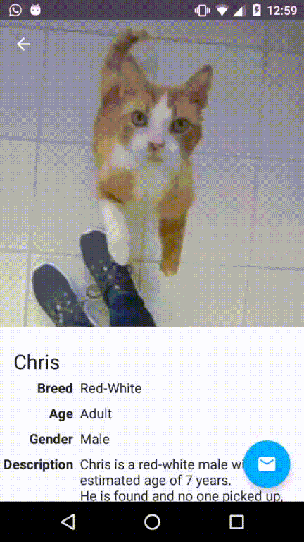

# Pet Utrecht

*Adopt dogs and cats in the city of Utrecht*

Pet Utrecht is an app that facilitates adoption of pets in the city of Utrecht. It follows [material design](https://www.google.com/design/spec/) and implements its transitions. It hopes to delight the user with its design and make the user adopt a pet.

### Screenshots

